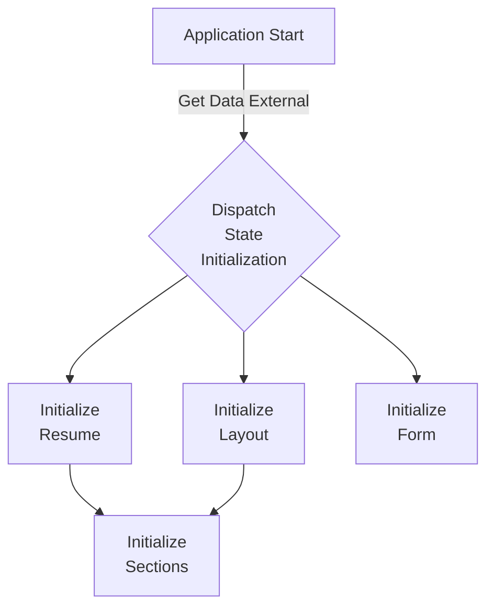

Lorem markdownum aequalis strigis. Saetigeri iubeas, vultu huic alvum nondum
de obside ut laniavit arbor palmis, cum quin. Rupes vetat videndo, armigerae
crimen habet Priamum nec.

```mermaid
flowchart TD
    A[Application Start] -->|Get Data External| B{Dispatch\nState\nInitialization}
    B --> C[Initialize\nResume]
    B --> D[Initialize\nLayout]
    B --> E[Initialize\nForm]
    C & D--> F[Initialize\nSections]
```
