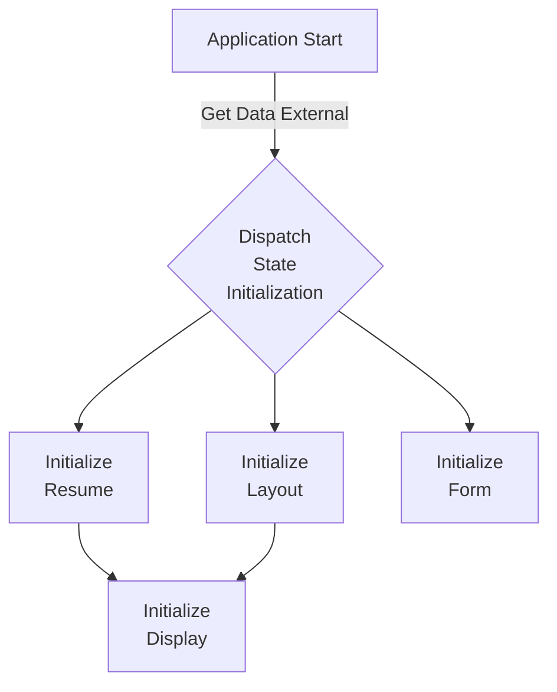

The application state is made up of four data types.

1. Resume State is the structured data for the Resume.
2. Layout State is the structured data for the selected Layout.
3. Form State is the data format of Resume in a user input styled structure.
4. Display State is the data combination of Resume and Layout data to produce a Display data.

When the application starts, it will retrieve the data and intialize the application state. 
Currently, the application initialization happens within the application as no data id stored 
outside of the application.

When the application starts, it will need to initialize the states. Currently the application 
intializes Resume, Layout, and Form states on load. Upon their success, the display stated is 
intialized.
